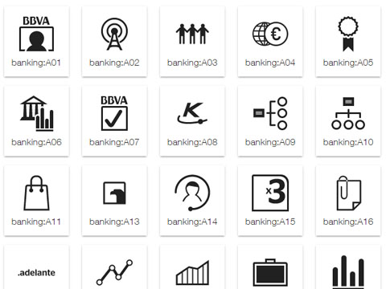

# cells-atom-icon


[Demo of component in Cells Catalog](https://bbva-ether-cellscatalogs.appspot.com/?view=demo#/component/cells-atom-icon)

`<cells-atom-icon>` is an element that wraps iron-icon and adds sizing classes to set the icon width and height.

Example:

```html
<cells-atom-icon icon="banking:A01" class="icon-size-24"></cells-atom-icon>
```

Use a class `icon-size-<size>` to set the width and height of the icon. Available sizes goes from 8 to 64px (only even numbers).

If you need an icon size that is not covered using a class, set the size using `--cells-atom-icon-size` custom property.

The icon color can be set using the color property.

Example:

```html
<style is="custom-style">
.custom-size {
--cells-atom-icon-size: 50px; /* sets width and height */
}
</style>
```

If you need to add iron-icon specific styles you can set them using `--cells-atom-icon-iron-icon` custom property.

Example:

```html
<style is="custom-style">
  cells-atom-icon {
    --cells-atom-icon-size: 3rem;
    --cells-atom-icon-iron-icon; {
        left: 2rem;
    }
  }
</style>
```

## Styling

The following custom properties and mixins are available for styling:

| Custom property | Description     | Default        |
|:----------------|:----------------| :--------------|
| --cells-atom-icon           | icon mixin                    | {}             |
| --cells-atom-icon-size      | icon size (width and height)  | 1rem (16px)    |
| --cells-atom-icon-iron-icon | inner iron icon               | {}             |
