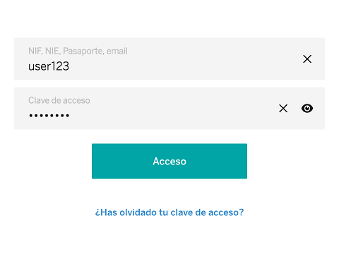

# cells-credentials-form

[](http://bbva-files.s3.amazonaws.com/cells/bbva-catalog/index.html)

[Demo of component in Cells Catalog](http://bbva-files.s3.amazonaws.com/cells/bbva-catalog/index.html#/elements/cells-credentials-form)

This component provides a form with basic user-password authentication.

It uses `cells-molecule-input` to present an ID field and a password field. ID field can receive a clear field icon; password field can receive both a clear field and a toggle password icon.

```html
<cells-credentials-form clear-id-icon="coronita:close" clear-pwd-icon="coronita:close" toggle-pwd-icon="coronita:visualize" toggle-pwd-icon-toggled="coronita:hide"></cells-credentials-form>
```

The form will show a "Did you forget your password?" button. You can show also a "Are you not an user? Register" button adding the `register` attribute.

```html
<cells-credentials-form register clear-id-icon="coronita:close" clear-pwd-icon="coronita:close" toggle-pwd-icon="coronita:visualize" toggle-pwd-icon-toggled="coronita:hide"></cells-credentials-form>
```

Also, using the `autofocus` attribute, the user Id field will receive focus when the page is loaded.

```html
<cells-credentials-form autofocus clear-id-icon="coronita:close" clear-pwd-icon="coronita:close" toggle-pwd-icon="coronita:visualize" toggle-pwd-icon-toggled="coronita:hide"></cells-credentials-form>
```

Tapping any of the buttons will fire an event. Activating the submit button will fire an event passing the user Id and user Password field values as payload. The submit button will be disabled until both fields are filled.

The component uses the attribute `user-name`, with the user name as value, to treat the user as already logged. This will hide the userId field and show a user greeting and a "change user" button above the password field.

```html
<cells-credentials-form user-name="John" user-id="loremipsum" clear-pwd-icon="coronita:close" toggle-pwd-icon="coronita:visualize" toggle-pwd-icon-toggled="coronita:hide"></cells-credentials-form>
```

The component can optional use cells-input-validation-behavior to validate and mask input user login value.

```html
<cells-credentials-form user-name="John" user-id="loremipsum"  input-user-options="[[inputUserOptions]]"></cells-credentials-form>
```
```js
  {
    autoValidate: true,
    inputStatusValidate: true,
    inputType: 'text',
    allowedValue: "rut",
    errorMessage: 'rutMsg',
    errorMessageIcon: 'coronita:error',
    mask: 'rut',
    maxLength: '13'
  }

```

Also, the component can show a selector for select a document type and validate the identity of the user. The selector is shown when document-type property is filled.

````html
 <cells-credentials-form id="ui"
    document-type="{{itemSelected}}"
    clear-id-icon="coronita:close"
    clear-pwd-icon="coronita:close"
    toggle-pwd-icon="coronita:visualize"
    toggle-pwd-icon-toggled="coronita:hide">
  </cells-credentials-form>
````

Document type is an object that has the rules to validate username, error message and other stuff related with the userId validation.

````json
{
    id: 'M',
    allowedValue: '^[\\w-_/.]{3,15}$',
    maxLength: 15,
    max: 15,
    min: 3,
    type: 'text',
    errorMessageIcon: 'coronita:alert',
    errorMessage: 'glomo-login-generic-error-message',
    name: 'glomo-login-document-type-M'
  }
````

The selector shown is a fake selector that fires an "select-document-type" event when is clicked. Usually the selector values are represented in into a cells-modal-selector as it can be seen in the demo.


## Icons

Since this component uses icons, it will need an [iconset](https://bbva.cellsjs.com/guides/best-practices/cells-icons.html) in your project as an [application level dependency](https://bbva.cellsjs.com/guides/advanced-guides/application-level-dependencies.html). In fact, this component uses an iconset in its demo.

## Styling

The following custom properties and mixins are available for styling:

| Custom property                                                         | Description                                                   | Default                  |
|:------------------------------------------------------------------------|:--------------------------------------------------------------|:-------------------------|
| --cells-credentials-form-input-min-height                               | min height for input fields                                   | 60px (3.75rem)           |
| --cells-credentials-form-input-field-withcontent                        | empty mixin for input fields content                          | {}                       |
| --cells-credentials-form-input-wrapper                                  | empty mixin for input field wrapper div                       | {}                       |
| --cells-credentials-form                                                | empty mixin for component                                     | {}                       |
| --cells-credentials-form-inputs-input                                   | empty mixin for cells-molecule-input                          | {}                       |
| --cells-credentials-form-inputs-input-withcontent                       | empty mixin for cells-molecule-input[has-content]             | {}                       |
| --cells-credentials-form-inputs                                         | empty mixin for cells-molecule-input wrapper                  | {}                       |
| --cells-credentials-form-submit-button                                  | empty mixin for submit button                                 | {}                       |
| --cells-credentials-form-submit                                         | empty mixin for submit button wrapper                         | {}                       |
| --cells-credentials-form-extra-actions                                  | empty mixin for extra actions aside                           | {}                       |
| --cells-credentials-form-extra-actions-logged                           | empty mixin for extra actions with :host([is-logged])         | {}                       |
| --cells-credentials-form-actions-buttons                                | empty mixin for action buttons                                | {}                       |
| --cells-credentials-form-actions                                        | empty mixin for action buttons wrappers                       | {}                       |
| --cells-credentials-form-forgotten-pwd                                  | empty mixin for forgotten password button wrapper             | {}                       |
| --cells-credentials-form-change-user                                    | empty mixin for change user button wrapper                    | {}                       |
| --cells-credentials-form-register-is-logged                             | empty mixin for register button wrapper if user is logged     | {}                       |
| --cells-credentials-form-register                                       | empty mixin for register button wrapper                       | {}                       |
| --cells-credentials-form-user-image                                     | empty mixin for user image                                    | {}                       |
| --cells-credentials-form-user-greeting                                  | empty mixin for user greeting text                            | {}                       |
| --cells-credentials-form-user-name                                      | empty mixin for user name text                                | {}                       |
| --cells-credentials-form-user                                           | empty mixin for user wrapper                                  | {}                       |
| --cells-credentials-form-fake-selector-bg-color                         | background color for .fake-selector                           | var(--bbva-100, #F4F4F4) |
| --cells-credentials-form-fake-selector-focus                            | empty mixin for document type selector focus                  | {}                       |
| --cells-credentials-form-fake-selector                                  | empty mixin for document type selector                        | {}                       |
| --cells-credentials-form-fake-selector-modal-icon-color                 | color for .modal-icon                                         | var(--bbva-white, #fff)  |
| --cells-credentials-form-fake-selector-modal-icon                       | empty mixin for selector dropdown icon                        | {}                       |
| --cells-credentials-form-fake-selector-label-color                      | fake-selector selected label color                            | var(--bbva-500, #666666) |
| --cells-credentials-form-fake-selector-label-selected-color             | fake-selector selected label selected color                   | var(--bbva-400, #BDBDBD) |
| --cells-credentials-form-fake-selector-label                            | empty mixin for selector label                                | {}                       |
| --cells-credentials-form-fake-selector-placeholder-color                | font color of fake-selector placeholder                       | var(--bbva-white, #fff)  |
| --cells-credentials-form-fake-selector-placeholder-selected-icon-color  | icon color in fake-selector placeholder when is selected icon | var(--bbva-white, #fff)  |
| --cells-credentials-form-fake-selector-placeholder                      | empty mixin for selector placeholder                          | {}                       |
| --cells-credentials-form-form                                           | empty mixin for form tag                                      | {}                       |
| --cells-credentials-form-animated-user;                                 | empty mixin for form animated tag user                        | {}                       |
| --cells-credentials-form-animated-change-user;                          | empty mixin for form animated change user                     | {}                       |
| --cells-credentials-form-animated-inputs-button;                        | empty mixin for form animated input buttons                   | {}                       |
| --cells-credentials-form-animated-inputs-button-molecule-input-not-last;| empty mixin for form animated input button molecule input not last| {}                   |
| --cells-credentials-form-animated-cells-molecule-input-first;           | empty mixin for form animated cells molecule input first of type| {}                     |
| --cells-credentials-form-animated-cells-molecule-input-last;            | empty mixin for form animated cells molecule input last of type| {}                      |
| --cells-credentials-form-animated-submit-button;                        | empty mixin for form animated submit button                    | {}                      |
| --cells-credentials-form-animated-extra-actions-p;                      | empty mixin for form animated extra actions p                  | {}                      |
