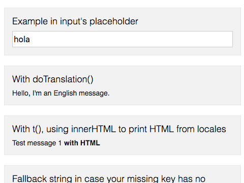

# cells-i18n-behavior


[Demo of component in Cells Catalog](https://bbva-ether-cellscatalogs.appspot.com/?view=demo#/component/cells-i18n-behavior)

`CellsBehaviors.i18nBehavior` provides a normalized interface for translate strings.

## Import

1) Import the behavior in your component:

```html
<link rel="import" href="../cells-i18n-behavior/cells-i18n-behavior.html">
```

2) Add `CellsBehaviors.i18nBehavior` to the behaviors list in the JS file or script of your component:

```js
...
 behaviors: [
   window.CellsBehaviors.i18nBehavior
 ],
 ...
 ```

## Usage

**string-to-translate** is the key to the string or message ('locale') in the corresponding language, in your **locales/{lang}.json** files.

 __Note:__ It is recommended that the keys have the name of the component as suffix. E.g. 'cells-basic-login-greeting' or 'cells-basic-login-username'

 1. Basic usage

    ```html
    {{doTranslation('string-to-translate')}}
    ```

    or, in a shorter but equivalent way (t() is just an alias of doTranslation()):

    ```html
    {{t('string-to-translate')}}
    ```

 2. Define an optional 'fallback' string with the second parameter (the **Fallback string** will display if **string-to-translate** key doesn't exist in 'locales'.)

    ```html
    {{t('string-to-translate', 'Fallback string')}}
     ```

 3. For asynchronous translation on attached:

    ```js
    attached: function() {
      this.getMsg('string-to-translate').then(function(translation) {
        this.set('readyTranslation', translation);
      }.bind(this));
    }
    ```

 4. Define an optional 'interpolation' string object with the third parameter::

    ```html
    {{t('string-to-translate', '', '{"attribute": "value"}')}}
     ```

    Interporlation object can be self properties:

    ```html
    [[t('string-to-stranslate-with-ref-to-self-property')]]
    ```

__Note:__ If **string-to-translate** contains a comma (,) it must be escaped by preceding it with a '\'

Example:

```html
<p>
 {{t('Welcome')}}
 <input type="text" placeholder="{{t('Username\, Email or UserID')}}">
</p>
```

## Locales (translations)

Finally, have the translations for each language on the *locales* folder.

This folder will have one JSON file for each supported language (en.json, es.json, en-US.json, etc).

For every language the Object defined contains all translated strings indexed by a unique ID, which is the same across all languages.

***en.json:***

```json
{
  "your-component-name-cancel": {            // valid old syntax
    "message": "Cancel"
  },
  "your-component-name-info": "Information", //simple syntax
  "explicitText": { "${attribute}, hello!" },
  "arrayText": ["part1", "part2", "...", "partN"],
  "self-property-msg": "My property value is ${propertyName}"
}
```

***es.json:***

```json
{
  "your-component-name-cancel": "Cancelar", //simple syntax
  "explicitText": { "Hola ${attribute}!" },
  "arrayText": ["part1", "part2", "...", "partN"]
}
```

## Disable translations

To disable the translation functionality (for instance, in applications that don't have locales folder), set `window.I18nMsg.disabled` to `true` to
prevent network requests to non-existent locales files.

In your main html file (index.html):

```js
  window.I18nMsg = window.I18nMsg || {};
  window.I18nMsg.disabled = true;
```
