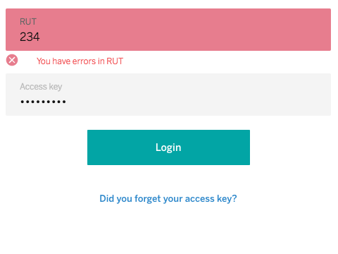

# cells-input-validations-behavior

[](http://bbva-files.s3.amazonaws.com/cells/bbva-catalog/index.html)

[Demo of component in Cells Catalog](http://bbva-files.s3.amazonaws.com/cells/bbva-catalog/index.html#/elements/cells-input-validations-behavior)

cells-input-validations-behavior is a behaviour to format and validate custom user logins. This component receives a configuration object with validation and one mask parameters.

Example config object to *validate* input value:
```js
  {
    autoValidate: false,
    inputStatusValidate: true,
    inputType: 'text',
    allowedValue: "rut",
    errorMessage: 'rutMsg',
    errorMessageIcon: 'coronita:error',
    mask: 'rut',
    maxLength: '13'
  }
```
Example config object to validate and *apply masked format (maskEnabled)* input value:

```js
  {
    autoValidate: false,
    inputStatusValidate: true,
    inputType: 'text',
    allowedValue: "rut",
    errorMessage: 'rutMsg',
    errorMessageIcon: 'coronita:error',
    mask: 'rut',
    maxLength: '13',
    maskEnabled: true
  }
```

In possible validate more than one regular expression setting on array to property allowedValue or allowedPassword value

```js
    {
    autoValidate: true,
    inputType: 'password',
    allowedPasswordValue: ['mxRepeatPassword', 'mxFollowedPassword'],
    errorPasswordMessage: ['mxRepeatPassword', 'mxFollowedPassword'],
  }
```
