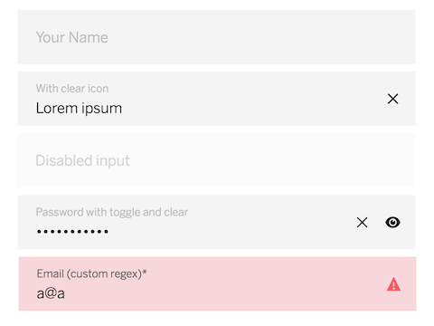

# cells-molecule-input

[](http://bbva-files.s3.amazonaws.com/cells/bbva-catalog/index.html)

[Issues](https://docs.google.com/spreadsheets/d/1etibyQVGoFKCvRiKlumzQStLAkQTPcfpTxFh2K5vSVs/edit?usp=sharing)

[Demo of component in Cells Catalog](http://bbva-files.s3.amazonaws.com/cells/bbva-catalog/index.html#/elements/cells-molecule-input)

`<cells-molecule-input>` contains an `iron-input` with a floating label. When input value is empty, label acts as a placeholder for the input. Otherwise, it floats over the input value.

This component can include up to two optional icons, which can have different functionalities. Also, it includes validation functionalities beyond the ones provided by 'iron-input' component.

## Types and basic usage

User must define a `label` tag for the input, which will show the main label/placeholder of the input. Default type is `text`, but you can use the `type` attribute to set a different one. Allowed types are:

- Text
- Password
- Number
- Email

```html
<cells-molecule-input label="Your Name"></cells-molecule-input>
<cells-molecule-input label="Your ID" type="number" value="123456"></cells-molecule-input>
```


`disabled` attribute can be used to prevent the input from being edited or modified with specific style and **not** submitted when in a form

```html
<cells-molecule-input label="Your password" type="password" disabled></cells-molecule-input>
```

`readonly` attribute can be used to prevent the input from being edited or modified but displayed as a normal input and submitted when in a form

```html
<cells-molecule-input label="Informative" type="text" value="Only can be read" readonly></cells-molecule-input>
```

`name` attribute can be set if input is going to be used inside/mapped to a form.

```html
<cells-molecule-input label="Your Name" name="yourNameField"></cells-molecule-input>
```


Setting the `select-all-on-focus` attribute will make the entire input value to be selected when input gets focused.

```html
<cells-molecule-input label="Your Name" value="Element number 1" select-all-on-focus></cells-molecule-input>
```


The `autofocus` attribute will make the input to be automatically focused when the page is loaded.

```html
<cells-molecule-input label="Your Name" autofocus></cells-molecule-input>
```

The `shy-placeholder` attribute will hide the placeholder when the input has some content, preventing the placeholder from floating over the input.

```html
<cells-molecule-input label="Your Name" shy-placeholder></cells-molecule-input>
```


## Main icon and secondary icon

The component can have one, two or zero action icons defined. User can pass an icon to the `icon` attribute to define a main icon, and to the `extra-icon` attribute to define a secondary icon. You must use also `icon-label` and `extra-icon-label` attributes to provide textual description of the icons functionality.

```html
<cells-molecule-input label="Your Name" icon="coronita:close" icon-label="Clear field"></cells-molecule-input>
```

Both for the main and the secondary icon, you can use `icon-toggled` and `extra-icon-toggled` attributes to define a 'toggle icon': an additional icon which will replace the current icon once it's activated.

```html
<cells-molecule-input label="Password" type="password" icon="coronita:visualize" icon-toggled="coronita:hide" icon-label="View or hide password" extra-icon="coronita:close" extra-icon-label="Clear field"></cells-molecule-input>
```

The icon passed to `error-icon` attribute is used when the input gets an invalid state.

```html
<cells-molecule-input label="Your email" type="email" auto-validate error-icon="coronita:alert"></cells-molecule-input>
```

`icon-size` attribute can be used to define a specific size (in pixels) to the input icons.

```html
<cells-molecule-input label="Your Name" icon="coronita:close" icon-size="26" icon-label="Clear field"></cells-molecule-input>
```

### Icon action
Activating an icon will fire an event, but also, predefined functionalities can be called. Available functionalities for the input are:

- **clear**: activating the icon will set empty the input value and will return focus to the input.
- **toggle**: activating the icon will set the input type to 'text' or to its original type. Also, it will toggle between original icon and toggled icon, and will return focus to the input.
- **event**: activating the icon will just fire an event.
- **none**: the icon won't even be a button; so, it won't be clickable, and it wont' fire any event.

If an input with the type 'password' has an icon and an iconToggled, it will receive the 'toggle' functionality by default. Any other case (with an icon defined) will use the 'clear' functionality by default.

You can use the 'iconAction' or 'extraIconAction' properties to override the default functionalities with one of the available functionalities (clear, toggle, event or none).

```html
<cells-molecule-input label="Your secret ID" icon="coronita:visualize" icon-toggled="coronita:hide" icon-label="Toggle state" icon-action="toggle"></cells-molecule-input>
<cells-molecule-input label="Your personal code" icon="coronita:alert" icon-action="event" icon-label="Warning"></cells-molecule-input>
<cells-molecule-input label="Your credit card" icon="coronita:creditcard" icon-action="none" ></cells-molecule-input>
```

### Icon visibility
Icons are only visible under certain conditions.

- **focused**: icon is visible if the component is focused.
- **content**: icon is visible if component value is not empty.
- **focused-content**: icon is visible if component is focused or if component value is not empty.
- **always**: icon is always visible.

A 'password' type input which acts as a toggle (changing the input type to 'text' and back) will be visible by default both when it's focused or when it has content. Any other case (with an icon defined) will be visible by default when the input has any content in it.

Use the 'iconVisibility' or 'extraIconVisibility' properties to override the default visibility of an icon.

```html
<cells-molecule-input label="Your card" icon="coronita:creditcard" icon-visibility="always" icon-label="View credit card"></cells-molecule-input>
<cells-molecule-input label="Your code" icon="coronita:alert" extra-icon="coronita:alarm" extra-icon-visibility="focused" icon-label="Warning" extra-icon-label="Check warning message"></cells-molecule-input>
```

## Validations
Component can validate or limit the input content in different ways.

You can invoke the `validate` method on the component to run a validation of the input value, or add the `auto-validate` attribute to have it automatically validated when the value changes.

```html
<cells-molecule-input label="Your email" type="email" auto-validate></cells-molecule-input>
```

`error-message` attribute can be used to show an error message when input value is invalid. You can also use the `error-icon` attribute to pass an icon to show when the input is invalid or/and
`error-message-icon` attribute to show an icon before message error label when the input is invalid and icon exist.

```html
<cells-molecule-input label="Your email" type="email" auto-validate error-message="You must enter a valid email" error-icon="coronita:alert"></cells-molecule-input>
```

The component will use the `iron-input` own validation based on input type. You can use the the `allowed-value` attribute to pass a specific regular expression instead. The value must match the regular expression to validate correctly.

```html
<cells-molecule-input label="Your email" type="email" auto-validate error-message="You must enter a valid email ending in .com" allowed-value="^[a-zA-Z0-9.!#$%&’*+/=?^_`{|}~-]+@[a-zA-Z0-9-]+.com$"></cells-molecule-input>
```

Also, setting the `required` attribute to true will make the input validation to fail when its value is empty.

```html
<cells-molecule-input label="Your name" required error-message="This field cannot be empty"></cells-molecule-input>
```

`max-length` attribute can be set to limit the length of the value.

```html
<cells-molecule-input label="Your ID" type="number" max-length="8"></cells-molecule-input>
```

`prevent-invalid-input` attribute can be set to true to prevent user from entering incorrect input, as in `iron-input`. It will use the input type for it (only supported for type=number), but you can also use the `allowed-chars` attribute to set which characters are allowed. This attribute can receive a regular expression which reflects the allowed characters.

```html
<cells-molecule-input label="Your username" type="text" max-length="10" prevent-invalid-input allowed-chars="[a-zA-Z0-9]"></cells-molecule-input>
```

### Custom pattern and mask

The component can validate and/or mask the typed value according to a custom pattern defined in a parent component using [cells-input-validations-behavior](https://globaldevtools.bbva.com/bitbucket/projects/CBH/repos/cells-input-validations-behavior/browse).
To use this feature, you should set the following set of properties as follows:

**Example property config for a RUT validation/mask:**

| Property name | Value |
|:--------------|:------|
| autoValidate  | true  |
| inputStatusValidate | true |
| autoMask | true |
| type | 'text' |
| allowedValue | 'rut' |
| errorMessage | 'rutMsg' |
| errorMessageIcon | 'coronita:error' |
| mask | 'rut' |
| customPattern | '[a-zA-Z0-9]{1,}' |
| maxLength | 13 |

`autoMask` toggles real time formatting by [cells-input-validations-behavior](https://globaldevtools.bbva.com/bitbucket/projects/CBH/repos/cells-input-validations-behavior/browse) and `customPattern` allows to define the custom validation format.

You can pass the set of properties as an object binded to a property of a parent component. An implementation of this feature can be found in [cells-credentials-form](https://globaldevtools.bbva.com/bitbucket/projects/CO/repos/cells-credentials-form/browse).

## Icons

Since this component uses icons, it will need an [iconset](https://bbva.cellsjs.com/guides/best-practices/cells-icons.html) in your project as an [application level dependency](https://bbva.cellsjs.com/guides/advanced-guides/application-level-dependencies.html). In fact, this component uses an iconset in its demo.

## Styling

The following custom properties and mixins are available for styling:


Custom property                                        | Description                                               | Default
:----------------------------------------------------- | :-------------------------------------------------------- | :---
--cells-molecule-input                                 | Empty mixin for component                                 | {}
--cells-molecule-input-background-color                | Input background color                                    | #F4F4F4
--cells-molecule-input-border-bottom                   | Input border-bottom                                       | solid 1px var(--bbva-white, #fff)
--cells-molecule-input-both-icons-visible              | Empty mixin for icons when both icons are visible         | {}
--cells-molecule-input-button-active-color             | Icon buttons color on active                              | #1162A5
--cells-molecule-input-button-color                    | Icon buttons color                                        | #121212
--cells-molecule-input-button-focus-color              | Icon buttons color on focus                               | #2A86CA
--cells-molecule-input-button-hover-color              | Icon buttons color on hover                               | #2A86CA
--cells-molecule-input-disabled-background-color       | Disabled input background color                           | rgba(244, 244, 244, 0.4)
--cells-molecule-input-disabled-field-input            | Empty mixin for input when it is disabled                 | {}
--cells-molecule-input-disabled-field-input-color      | Input text color when it is disabled                      | #D3D3D3
--cells-molecule-input-disabled-field-label            | Empty mixin for label when input is disabled              | {}
--cells-molecule-input-disabled-field-label-color      | Disabled input label color                                | #D3D3D3
--cells-molecule-input-disabled-icon-visible           | Disabled input icon visible but disabled
--cells-molecule-input-disabled-icon-visible-iron-icon | Disabled icon color                                       | #D3D3D3
--cells-molecule-input-disabled-wrapper                | Empty mixin for field and error wrapper on disabled state | {}
--cells-molecule-input-readonly-field-input            | Empty mixin for input when it is readonly                 | {}
--cells-molecule-input-readonly-field-label            | Empty mixin for label when input is readonly              | {}
--cells-molecule-input-readonly-wrapper                | Empty mixin for field and error wrapper on readonly state | {}
--cells-molecule-input-field                           | Empty mixin for input and label wrapper                   | {}
--cells-molecule-input-field-input                     | Empty mixin for input                                     | {}
--cells-molecule-input-field-input-color               | Input text color                                          | #121212
--cells-molecule-input-field-label                     | Empty mixin for label                                     | {}
--cells-molecule-input-field-label-color               | Label color                                               | #BDBDBD
--cells-molecule-input-field-min-height                | Input min height                                          | 60px (3.75rem)
--cells-molecule-input-has-content-wrapper             | Empty mixin for field when it has content                 | {}
--cells-molecule-input-has-content-invalid-wrapper     | Empty mixin for field wrapper when it has invalid content | {}
--cells-molecule-input-has-content-invalid-field       | Empty mixin for field when it has invalid content         | {}
--cells-molecule-input-has-content-invalid-icon        | Empty mixin for icon when the field has invalid content   | {}
--cells-molecule-input-icon                            | Empty mixin for icons                                     | {}
--cells-molecule-input-icon-button                     | Empty mixin for icon buttons                              | {}
--cells-molecule-input-icon-button-size                | Icon buttons size                                         | 50px (3.125rem)
--cells-molecule-input-icon-visible                    | Empty mixin for icon buttons when visible                 | {}
--cells-molecule-input-icons-button-gutter             | Icon buttons width adjustement when both icons are used   | 8px (0.5rem)
--cells-molecule-input-invalid-background-color        | Invalid input background color                            | #F8D7DC
--cells-molecule-input-invalid-border-bottom           | Invalid input border bottom                               | var(--bbva-dark-red, #b92a45)
--cells-molecule-input-invalid-error-icon-color        | Error icon button color                                   | #f35e61
--cells-molecule-input-invalid-field-input             | Input text color when it is invalid                       | {}
--cells-molecule-input-invalid-field-label             | Empty mixin for label when input is invalid               | {}
--cells-molecule-input-invalid-field-label-color       | Invalid input label color                                 | #666666
--cells-molecule-input-invalid-icon-error              | Empty mixin for error icon                                | {}
--cells-molecule-input-invalid-wrapper                 | Empty mixin for field and error wrapper on invalid state  | {}
--cells-molecule-input-left-icon-button                | Empty mixin for secondary icon when both icons are used   | {}
--cells-molecule-input-number-spin-buttons             | Empty mixin for input number spinners                     | {}
--cells-molecule-input-right-icon-button               | Empty mixin for main icon when both icons are used        | {}
--cells-molecule-input-error-message-wrapper-iron-icon | Empty mixin for icon in message section below the input   | {}
--cells-molecule-input-error-message-icon-color        | Color for icon in error message                           | #f35e61
--cells-molecule-input-text-error                      | Empty mixin for error message                             | {}
--cells-molecule-input-text-error-color                | Error message text color                                  | #121212
--cells-molecule-input-text-error-message-wrapper      | Empty mixin applied to the error message wrapper          | {}
--cells-molecule-input-withcontent-field-input         | Empty mixin for input when it has content                 | {}
--cells-molecule-input-withcontent-field-label         | Empty mixin for label when input has content              | {}
--cells-molecule-input-withicon-field-input            | Empty mixin for input when it has icon                    | {}
--cells-molecule-input-wrapper                         | Empty mixin for field and error wrapper                   | {}
--cells-molecule-input-autofill                        | Empty mixin on use the autofill in mobile                 | {}