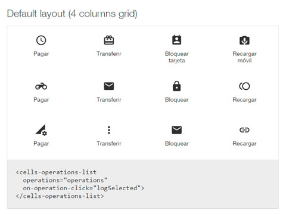

# cells-operations-list

[](http://bbva-files.s3.amazonaws.com/cells/bbva-catalog/index.html)

[Demo of component in Cells Catalog](http://bbva-files.s3.amazonaws.com/cells/bbva-catalog/index.html#/elements/cells-operations-list)

`<cells-operations-list>` displays a list in grid (default) or list mode with configurable length of available operations and an optional link to "show more" operations.
The "show more" link action shows the full list of operations by default, but can be customized by using `event.preventDefault()` on the `on-view-more` event.
Each operation has icon, label and ID.

Some of the options in the operations array can be disabled with the 'disabled' property

Example:

```html
<cells-operations-list
  operations="[[operations]]"
  grid-columns="2"
  limit="4"
  view-more
  on-view-more="customAction">
</cells-operations-list>
```

## Data model

`operations` Array

```js
[{
 label: 'Transfer',
 id: 'transfer',
 icon: 'coronita:transfer'
}]
```

`operations` Array with the option disabled

```js
[{
 label: 'Transfer',
 id: 'transfer',
 icon: 'coronita:transfer',
 disabled: 'true'
}]
```

`operations` Array with class

```js
[{
 label: 'Transfer',
 id: 'transfer',
 icon: 'coronita:transfer',
 class: 'custom'
}]
```

## Styling

The following custom properties and mixins are available for styling:

| Custom property                                    | Description                                                 | Default |
|:---------------------------------------------------|:------------------------------------------------------------|:-------:|
| --cells-fontDefault                                | font family for :host                              | sans-serif    |
| --cells-operations-list                            | Mixin applied to :host                             | {}    |
| --cells-operations-list-item-width                 | variable for change items width                             | 100%    |
| --cells-operations-list-list__link-width           | variable for change label link items width                  | 70px    |
| --cells-operations-list-item-label--grid           | Extends (for :host with default layout) --cells-molecule-link-icon-label | {}      |
| --cells-operations-list-list                       | Mixin applied to the list element                           | {}      |
| --cells-operations-list-list__item                 | Mixin applied to each list item                             | {}      |
| --cells-operations-list-list__link                 | Mixin applied to each link                                  | {}      |
| --cells-operations-list-list__link-color           | Color for link                                  | var(--bbva-white, #fff)   |
| --cells-operations-list__link-icon-label           | Extends --cells-molecule-link-icon-label                    | {}      |
| --cells-operations-list__link-icon-atom-icon       | Extends --cells-molecule-link-icon-atom-icon                | {}      |
| --cells-operations-list-list__link-icon            | Extends (for :host with list layout) --cells-molecule-link-icon-atom-icon | {}      |
| --cells-operations-list-list__link-active          | Mixin applied to each link in active state                  | {}      |
| --cells-operations-list-list__link-active-icon     | Mixin applied to each icon link in active state             | {}      |
| --cells-operations-list-list__link-grid            | Mixin applied to each link in grid mode                     | {}      |
| --cells-operations-list-item-label--list           | Extends (for :host with list layout) --cells-molecule-link-icon-label              | {}      |
| --cells-operations-list-list__item-not-first-child | Mixin applied to all the list items but not the first child | {}      |
| --cells-operations-list-list__item-not-last-child  | Mixin applied to all the list items but not the last child  | {}      |
| --cells-operations-list-disabled                   | Mixin applied to disabled item                              | {}      |
| --cells-operations-list__link-disabled-icon        | Extends --cells-molecule-link-icon-atom-icon, for disabled item | {}      |
