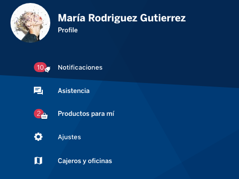

# cells-organism-menu-sidebar

[](http://bbva-files.s3.amazonaws.com/cells/bbva-catalog/index.html)

[Demo to component in Cells Catalog](http://bbva-files.s3.amazonaws.com/cells/bbva-catalog/index.html#/elements/cells-organism-menu-sidebar)

`cells-organism-menu-sidebar` is the component for the sidebar menu with app logo and
links to login/logout, profile settings and contact.

## Properties

### user

if `user` property is setted, the user is logged, then, it will show the sidebar for logged user, will show the profile user, and the footer with button loggout. So, will show the styles for user logged.

So, the property `userLogged` will be setted to __true__:

__Example:__

```js
var userProfile = {
  firstName: 'María',
  avatar: {
    url: './user-avatar.jpg'
  }
}
```

```html
<cells-organism-menu-sidebar user="[[userProfile]]">
</cells-organism-menu-sidebar>
```


### available-sections

This shows the menu of links and buttons.

__Example:__

```js
var sections = [{
  label: 'Notificaciones',
  icon: 'coronita:alarm',
  link: '#notifications',
  action: 'notifications-event',
  count: 10,
  status: {
    showNoLogged: true,
    showLogged: true
  }
}, {
  label: 'Asistencia',
  icon: 'coronita:communication',
  link: '#help',
  status: {
    showNoLogged: false,
    showLogged: false
  }
}, {
  label: 'Productos para mí',
  icon: 'coronita:supermarket',
  link: '#products',
  count: 2,
  status: {
    showNoLogged: true,
    showLogged: false
  }
}, {
  label: 'Ajustes',
  icon: 'coronita:settings',
  action: 'settings-event',
  status: {
    showNoLogged: false,
    showLogged: true
  }
}]
```

```html
<cells-organism-menu-sidebar user="[[userProfile]]" available-sections="[[sections]]">
</cells-organism-menu-sidebar>
```

When a menu link is clicked, the link fire an event, this event is the action of link.

__example__

```js
document.addEventListener('notifications-event', function() {
  // Listen event to click in link Notificaciones
})
```

## Icons

Since this component uses icons, it will need an [iconset](https://bbva.cellsjs.com/guides/best-practices/cells-icons.html) in your project as an [application level dependency](https://bbva.cellsjs.com/guides/advanced-guides/application-level-dependencies.html). In fact, this component uses an iconset in its demo.

## Styling

The following custom properties and mixins are available for styling:

| Custom property | Description     | Default        |
|:---------------:|:---------------:| :-------------:|
| --general-dimension-avatar | general dimesion for avatar | rem(80px) |
| --cells-fontDefault | font-family for host | sans-serif |
| --cells-organism-menu-sidebar-color | color applied to host | var(--bbva-white, #fff) |
| --cells-organism-menu-sidebar-bg | background applied to host | #062146 url("http://bbva-files.s3.amazonaws.com/cells/assets/glomo/images/access/fractal-bbva-navy.svg") bottom left no-repeat |
| --cells-organism-menu-sidebar | mixin applied to host | {} |
| --cells-organism-menu-sidebar-user-logged-bg | background for :host([user-logged]) | url("http://bbva-files.s3.amazonaws.com/cells/assets/glomo/images/access/fractal-bbva-core-blue.svg") bottom left no-repeat |
| --cells-organism-menu-sidebar-user-logged | mixin applied to :host([user-logged]) | {} |
| --cells-organism-menu-sidebar-before-bg-color | color for :host:before | var(--bbva-navy, #072146) |
| --cells-organism-menu-sidebar-before | mixin applied to :host:before | {} |
| --cells-organism-menu-sidebar-user | mixin applied to .user | {} |
| --cells-organism-menu-sidebar-user-avatar | mixin applied to .user__avatar | {} |
| --cells-organism-menu-sidebar-user-info-color | value for --cells-st-button-text-color-transparent | var(--bbva-white, #fff) |
| --cells-organism-menu-sidebar-user-info-hover | value for --cells-st-button-text-color-transparent-hover | var(--bbva-white, #fff) |
| --cells-organism-menu-sidebar-user-info-active | value for --cells-st-button-text-color-transparent-hover-active | var(--bbva-white, #fff) |
| --cells-organism-menu-sidebar-user-info | mixin applied to .user__info | {} |
| --cells-organism-menu-sidebar-user-info-name | mixin applied to .user__info-name | {} |
| --cells-organism-menu-sidebar-user-info-profile | mixin applied to .user__info-profile | {} |
| --cells-organism-menu-sidebar-user-info-button | mixin applied to .user__info-button | {} |
| --cells-organism-menu-sidebar-nav-list | mixin applied to .nav-list | {} |
| --cells-organism-menu-sidebar-nav-list-animate-sidebar | mixin applied to :host([animate-sidebar-items]) | {} |
| --cells-organism-menu-sidebar-nav-list-user-logged | mixin applied to :host([user-logged]) | {} |
| --cells-organism-menu-sidebar-nav-list-user-logged-li | mixin applied to .nav-list-li | {} |
| --cells-organism-menu-sidebar-link-item-color | color for .link-item | inherit |
| --cells-organism-menu-sidebar-link-item-bg | background for .link-item | transparent |
| --cells-organism-menu-sidebar-link-item | mixin for .link-item | {} |
| --cells-organism-menu-sidebar-link-item-disabled | mixin for .link-item disabled | {} |
| --cells-organism-menu-sidebar-link-item-icon | mixin for .link-item-icon | {} |
| --cells-organism-menu-sidebar-link-item-text | mixin for .link-item-text | {} |
| --cells-organism-menu-sidebar-link-item-count-bg-color| background for .link-item-count | var(--bbva-red, #DA3851) |
| --cells-organism-menu-sidebar-link-item-count | mixin for .link-item-count | {} |
| --cells-organism-menu-sidebar-link-item-count-icon | mixin for .link-item-count iron-icon | {} |
| --cells-organism-menu-sidebar-link-item-count-icon-color | Color for .link-item-count iron-icon | var(--bbva-navy, #072146) |
| --cells-organism-menu-sidebar-link-item-count | mixin for .link-item-count | {} |
| --cells-organism-menu-sidebar-footer | mixin for .footer | {} |
