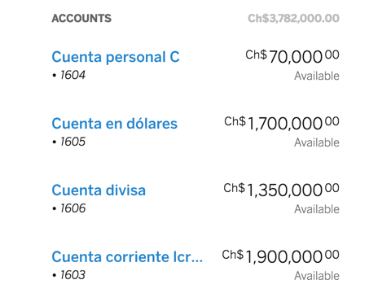

# cells-product-item-list

<!--
[](http://bbva-files.s3.amazonaws.com/cells/bbva-catalog/index.html)

[Demo of component in Cells Catalog](http://bbva-files.s3.amazonaws.com/cells/bbva-catalog/index.html#/elements/cells-product-item-list)
-->


`<cells-product-item-list>` displays a list of accounts or movements using `<cells-product-item>`.

The skeleton or loader element can be shown by setting the boolean property `loading` to `true`.
Also, the default skeleton component can be replaced by a custom one provided in a slot with name `loader`.

Example:

```html
<cells-product-item-list></cells-product-item-list>
```

Example with a custom skeleton and a custom error:

```html
<cells-product-item-list loading>
  <custom-skeleton slot="loader"></custom-skeleton>
  <custom-message-error slot="error-content"></custom-message-error>
</cells-product-item-list>
```


## Styling

The following custom properties and mixins are available for styling:

| Custom property | Description     | Default        |
|:----------------|:----------------|:--------------:|
| --cells-product-item-list  | Mixin applied to :host     | {} |
| --cells-fontDefault  | Mixin applied to :host font-family    | sans-serif |
| --cells-product-item-list-header  | Mixin applied to the header    | {} |
| --cells-product-item-list-list  | Mixin applied to the list    | {} |
| --cells-product-item-list-default-skeleton-bg-color  | background-color for the default skeleton    | #fff |
| --cells-product-item-list-default-skeleton  | Mixin applied to the default skeleton    | {} |
| --cells-product-item-list-error-message| Mixin applied to the default error message | {} |
