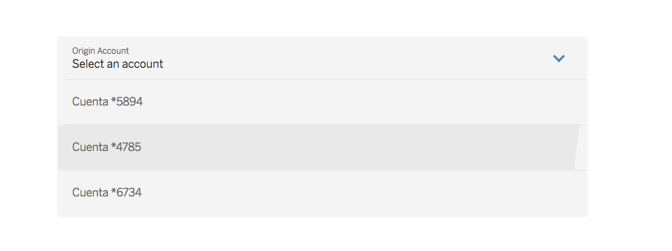

# cells-select

[](http://bbva-files.s3.amazonaws.com/cells/bbva-catalog/index.html)

[Demo to component in Cells Catalog](http://bbva-files.s3.amazonaws.com/cells/bbva-catalog/index.html#/elements/cells-select)

`<cells-select>` is a component to display a dropdown menu. It allows to select an option
from an array of `options`.

__Example:__

```html
<cells-select options="[]"></cells-select>
```

__Options array example:__

```js
[
  {
    title: 'Cuenta *5894',
    description: 5.687,05,
    currencyCode: 'USD'
  },
  {
    title: 'Cuenta *4785',
    description: 3.236,05,
    currencyCode: ''
  },
  {
    title: 'Cuenta *6734',
    description: 10.687,05
  }
]
```

`description` and `currencyCode` params are optional. These param are drawn on the option's
right.

To access to the actual selected option, you can obtain the value of
`selected` parameter.

If the elements of the dropdown is not fully display, you may have to add to parent element the `css` property `overflow: visible`.

With the property `focusOnSelect` it´s posible add focus when select will close.

## Styling

The following custom properties and mixins are available for styling:

| Custom property                           | Description                              | Default                          |
|:------------------------------------------|:-----------------------------------------| :-------------------------------:|
| --cells-fontDefault                       | Font family for :host                    | sans-serif                       |
| --cells-select                            | Mixin applied to :host                   | {}                               |
| --cells-select-color                      | Color of :host                           | var(--bbva-600, #121212)         |
| --cells-select-bg-color                   | Background color of :host                | var(--bbva-100, #F4F4F4)         |
| --cells-select-opened                     | Mixin applied to opened :host            | {}                               |
| --cells-select-header                     | Mixin applied to .header                 | {}                               |
| --cells-select-header-icon                | Mixin applied to .header's icon          | {}                               |
| --cells-select-header-icon-color          | Color of .header's icon                  | var(--bbva-medium-blue, #2A86CA) |
| --cells-select-headertexts                | Mixin applied to texts in header         | {}                               |
| --cells-select-label                      | Mixin applied to label                   | {}                               |
| --cells-select-label-color                | Color of label                           | var(--bbva-500, #666)            |
| --cells-select-placeholder                | Mixin applied to placeholder             | {}                               |
| --cells-select-placeholder-color          | Color of placeholder                     | var(--bbva-600, #121212)         |
| --cells-select-options                    | Mixin applied to .options                | {}                               |
| --cells-select-options-item               | Mixin applied to .options-item           | {}                               |
| --cells-select-disabled                   | Mixin applied to disabled :host          | {}                               |
| --cells-select-disabled-header-color      | Color of disabled :host's header         | var(--bbva-500, #666)            |
| --cells-select-disabled-header            | Mixin applied to disabled :host's header | {}                               |
| --cells-select-disabled-header-icon-color | Color of disabled :host's header's icon  | var(--bbva-400, #bdbdbd)         |
| --cells-select-opened-options             | Mixin applied to the list when the select is opened  | {}                     |


# <cells-select-item>

`<cells-select-item>` prints an item with a left title and an optional right description,
 which it can be a Number or text.

Expects a `data` object with the following format, `description` and `currencyCode` params are optional.
They are to be drawn on the option's right.

```json
{
  title: "Account *1234",
  description: "Personal"
}
```

If `description` is a Number, the `currencyCode` is also expected

```json
{
  title: "Account *1234",
  description: 3527.11,
  currencyCode: "USD"
}
```

Example:

    <cells-select-item data="[[item]]"></cells-select-item>

## Styling

The following custom properties and mixins are available for styling:

| Custom property                                        | Description                                     | Default                  |
|:-------------------------------------------------------|:------------------------------------------------| :-----------------------:|
| --cells-fontDefault                                    | Font family of :host                            | sans-serif               |
| --cells-select-item                                    | Mixin applied to :host                          | {}                       |
| --cells-select-item-color                              | Color of :host                                  | var(--bbva-500, #666)    |
| --cells-select-item-border-top-color                   | Color of separator between items                | #E5E5E5                  |
| --cells-select-item-lastchild                          | Mixin applied to :host's last-child             | {}                       |
| --cells-select-item-sibling                            | Mixin applied to sibling of :host               | {}                       |
| --cells-select-item-inheader                           | Mixin applied to :host in context of .header    | {}                       |
| --cells-select-item-inheader-icon                      | Mixin applied to .icon in context of .header    | {}                       |
| --cells-select-item-inheader-title                     | Mixin applied to .title in context of .header   | {}                       |
| --cells-select-item-selected                           | Mixin applied to [selected] :host               | {}                       |
| --cells-select-item-selected-color                     | Color of [selected] :host                       | var(--bbva-600, #121212) |
| --cells-select-item-selected-before                    | Mixin applied to ::before of [selected] :host   | {}                       |
| --cells-select-item-selected-before-bg-color           | Background color of ::before's [selected] :host | transparent              |
| --cells-select-item-selected-before-border-top-color   | Border top color of ::before's [selected] :host | var(--bbva-200, #e9e9e9) |
| --cells-select-item-hover                              | Mixin applied to :hover                         | {}                       |
| --cells-select-item-hover-before                       | Mixin applied to :hover:before                  | {}                       |
| --cells-select-item-focused                            | Mixin applied to focused :host                  | {}                       |
| --cells-select-item-title                              | Mixin applied to .title                         | {}                       |
| --cells-select-item-description-color                  | Color of description                            | #434A58                  |
| --cells-select-item-description                        | Mixin applied to .description                   | {}                       |
| --cells-select-icon                                    | Mixin applied to .icon                          | {}                       |
| --cells-select-custom                                  | Mixin applied to .custom                        | {}                       |
| --cells-select-custom-title                            | Mixin applied to custom title                   | {}                       |
| --cells-select-custom-icon                             | Mixin applied to custom icon                    | {}                       |
