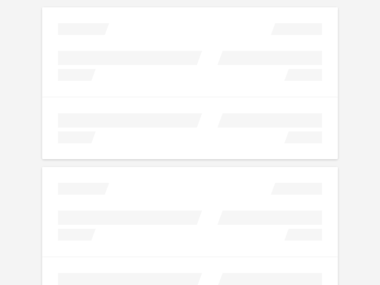

# cells-skeleton-loading-page

[](http://bbva-files.s3.amazonaws.com/cells/bbva-catalog/index.html)

[Demo of component in Cells Catalog](http://bbva-files.s3.amazonaws.com/cells/bbva-catalog/index.html#/elements/cells-skeleton-loading-page)

`<cells-skeleton-loading-page>` shows a full screen loading page with a skeleton style.

Example:

```html
<cells-skeleton-loading-page visible></cells-skeleton-loading-page>
```

## Styling

The following custom properties and mixins are available for styling:

| Custom property | Description     | Default        |
|:----------------|:----------------|:--------------:|
| --cells-skeleton-loading-page | Mixin applied to the :host | {} |
| --cells-skeleton-loading-page-visible | mixin applied to the :host when it is visible | {} |
| --cells-skeleton-loading-page-bg-color | background-color applied to :host | #F4F4F4 |
| --cells-skeleton-loading-page-group | mixin applied to the group items | {} |
| --cells-skeleton-loading-page-delay | transition-delay applied to each group item | 70ms |
