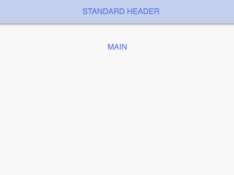

# cells-template-paper-header-panel

 

[Demo of component in Cells Catalog](https://bbva-ether-cellscatalogs.appspot.com/?view=demo#/component/cells-template-paper-header-panel)

__cells-template-paper-header-panel__ contains a header, main and footer section. It uses the __paper-header-panel__ to have different header and scrolling behaviors.

It includes:

  ```app__header``` - A container element for top app.

  ```app__main``` - A container element main content.

  ```app__footer``` - A container element for bottom app.

  ```app__overlay``` - A container element for overlay all content.

Example cells context: *(view demo for declarative app)*

```html
<cells-template-paper-header-panel></cells-template-paper-header-panel> 
```

The __mode__ property is necessary to the different header and scrolling behaviors. See [paper-header-panel](https://elements.polymer-project.org/elements/paper-header-panel).

```html
<cells-template-paper-header-panel mode="standard"></cells-template-paper-header-panel>
```

In the third example, it is used the __tallClass__ property to add a style to header section. This class is used with the __waterfall-tall__ mode.

```html
<cells-template-paper-header-panel mode="waterfall-tall" tall-class="medium-tall"></cells-template-paper-header-panel>
```
In the fourth example, it is used the transparent property to add a style to header section. This class is used with the seamed mode.

```html
<cells-template-paper-header-panel mode="seamed" >
  <header id="app__header" class="transparent"></header>
</cells-template-paper-header-panel>
```

## Content hooks

**Note:** in version 10.x content hooks use `slot` attribute instead of the previous `data-select`.

```html
<cells-template-paper-header-panel>
  <header slot="app__header"></header>
  <div slot="app__main"></div> 
  <div slot="app__footer"></div> 
  <div slot="app__overlay"></div> 
</cells-template-paper-header-panel>
```

## Styling

The following custom properties and mixins are available for styling:

| Custom property | Description     | Default        |
|:----------------|:----------------|:--------------:|
| --cells-template-paper-header-panel-scope      | scope description | default value  |
| --cells-template-paper-header-panel | empty mixin | {} |
| --cells-template-paper-header-panel-app__header | .app__header empty mixin | {} |
| --cells-template-paper-header-panel-app__container | .app__container empty mixin | {} |
| --cells-template-paper-header-panel-app__section | .app__section empty mixin  | {} |
| --cells-template-paper-header-panel-app__main | .app__main empty mixin | {} |
| --cells-template-paper-header-panel-app__footer | .app__footer empty mixin | {} |
| --cells-template-paper-header-panel-paper-header-waterfall-tall | .paper-header empty mixin in waterfall-tall mode | {} |
| --cells-template-paper-header-panel-app__header-background | .app__header background | transparent |
| --cells-template-paper-header-panel-app__main-max-width | .app__main max-width | 768px |
| --cells-template-paper-header-panel-app__main-padding | .app__main padding | 0 |
| --cells-template-paper-header-panel-paper-header-height | .paper-header height in waterfall-tall mode | 100px |
| --app__overlay-zindex | .app__overlay z-index | 0 |
| --cells-template-paper-drawer-panel-overlay | .app__overlay empty mixin | {} |
